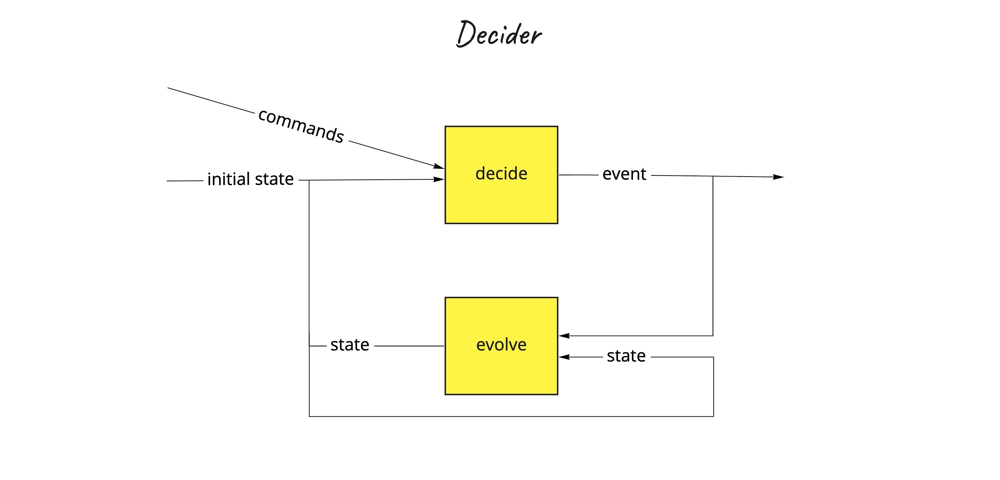
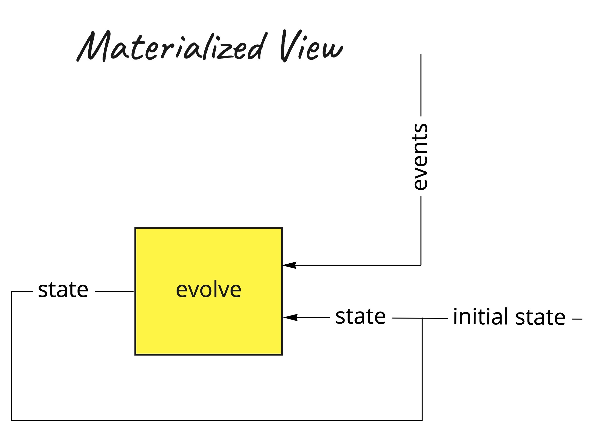
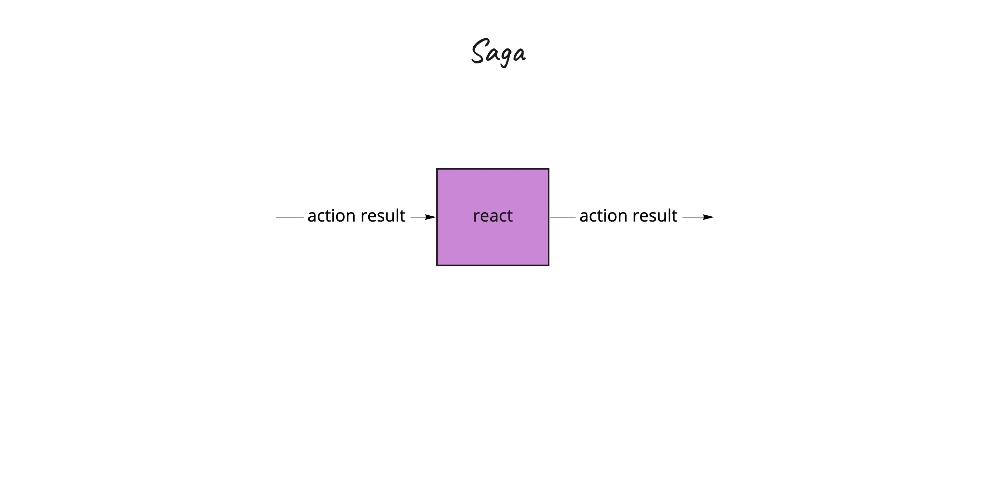
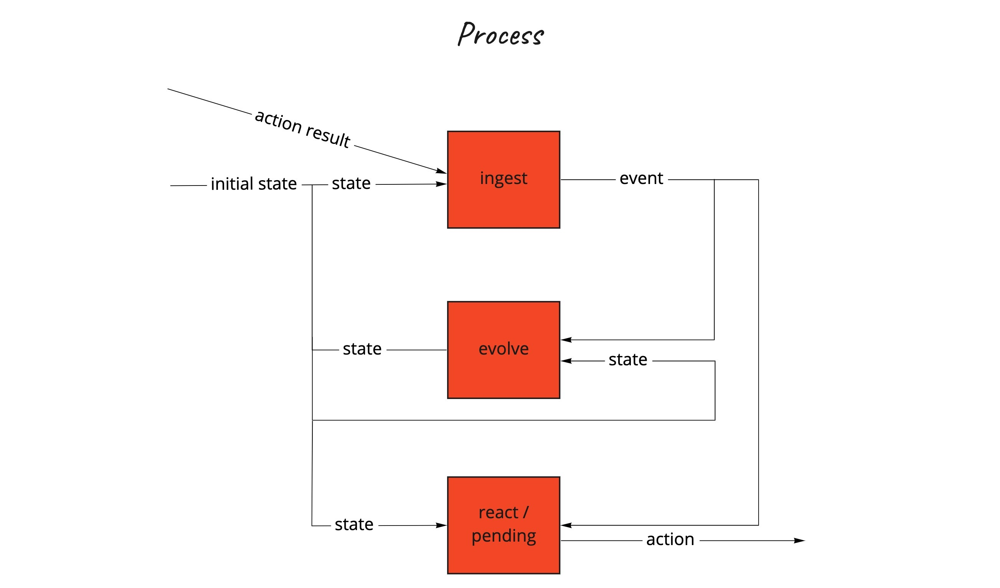

# **f`(`model`)`** - Functional domain modeling

When you’re developing an information system to automate the activities of the business, you are modeling the business. The abstractions that you design, the behaviors that you implement, and the UI interactions that you build all reflect the business — together, they constitute the model of the domain.

## `IOR<Library, Inspiration>`

This project can be used as a library, or as an inspiration, or both.

## Table of Contents

* [<strong>f(model)</strong> - Functional domain modeling](#fmodel---functional-domain-modeling)
    * [Abstraction and generalization](#abstraction-and-generalization)
    * [decide: (C, S) -&gt; Iterable&lt;E&gt;](#decide-c-s---iterablee)
    * [evolve: (S, E) -&gt; S](#evolve-s-e---s)
    * [Event-sourced or State-stored systems](#event-sourced-or-state-stored-systems)
        * [A statement:](#a-statement)
        * [A proof:](#a-proof)
        * [Event-sourced system decide: (C, Iterable&lt;E&gt;) -&gt; Iterable&lt;E&gt;](#event-sourced-system-decide-c-iterablee---iterablee)
        * [State-stored system decide: (C, S) -&gt; S](#state-stored-system-decide-c-s---s)
    * [Decider](#decider)
        * [Decider extensions and functions](#decider-extensions-and-functions)
        * [Event-sourcing aggregate](#event-sourcing-aggregate)
        * [State-stored aggregate](#state-stored-aggregate)
    * [View](#view)
        * [View extensions and functions](#view-extensions-and-functions)
        * [Materialized View](#materialized-view)
    * [Saga](#saga)
        * [Saga extensions and functions](#saga-extensions-and-functions)
        * [Saga Manager](#saga-manager)
    * [Process](#process)
        * [Process extensions and functions](#process-extensions-and-functions)
        * [Process Manager](#process-manager)
    * [Kotlin](#kotlin)
    * [References and further reading](#references-and-further-reading)
    
## Abstraction and generalization

Abstractions can hide irrelevant details and use names to reference objects. It emphasizes what an object is or does rather than how it is represented or how it works.

Generalization reduces complexity by replacing multiple entities which perform similar functions with a single construct.

Abstraction and generalization are often used together. Abstracts are generalized through parameterization to provide more excellent utility.

## `decide: (C, S) -> Iterable<E>`

On a higher level of abstraction, any information system is responsible for handling the intent (`Command`) and
based on the current `State`, produce new facts (`Events`):

- given the current `State/S` *on the input*,
- when `Command/C` is handled *on the input*,
- expect `list/iterable` of new `Events/E` to be published *on the output*

## `evolve: (S, E) -> S`

The new state is always evolved out of the current state `S` and the current event `E`:

- given the current `State/S` *on the input*,
- when `Event/E` is handled *on the input*,
- expect new `State/S` to be published *on the output*

## Event-sourced or State-stored systems

- State-stored systems are traditional systems that are only storing the current State by overwriting the previous State in the storage.
- Event-sourced systems are storing the events in immutable storage by only appending.

### A statement:

Both types of systems can be designed by using only these two functions and three generic parameters:

- `decide: (C, S) -> Iterable<E>`
- `evolve: (S, E) -> S`

There is more to it! You can switch from one system type to another or have both flavors included within your systems landscape.

### A proof:

We can fold/recreate the new state out of the list of events by using `evolve` function `(S, E) -> S` and providing the
initialState of type S as a starting point.

- `Iterable<E>.fold(initialState: S, ((S, E) -> S)): S`

Essentially, this `fold` is a function that is mapping a list of Events to the State: 

- `(Iterable<E>) -> S`

We can now use this function `(Iterable<E>) -> S` to:

- contra-map our `decide` function (`(C, S) -> Iterable<E>`) over `S` type to: `(C, Iterable<E>) -> Iterable<E>`  - **this is an event-sourced system**
- or to map our `decide` function (`(C, S) -> Iterable<E>`) over `E` type to: `(C, S) -> S` - **this is a state-stored system**


We can verify that we can design any information system (event-sourced or/and state-stored) in this way by using these two functions wrapped in a datatype class (algebraic data structure), which is generalized with three generic parameters:

```kotlin
data class Decider<C, S, E>(
    val decide: (C, S) -> Iterable<E>,
    val evolve: (S, E) -> S,
)
```

`Decider` is the most important datatype, but it is not the only one. There are others:


## Decider

`_Decider` is a datatype that represents the main decision-making algorithm. It belongs to the Domain layer. It has five
generic parameters `C`, `Si`, `So`, `Ei`, `Eo` , representing the type of the values that `_Decider` may contain or use.
`_Decider` can be specialized for any type `C` or `Si` or `So` or `Ei` or `Eo` because these types do not affect its
behavior. `_Decider` behaves the same for `C`=`Int` or `C`=`YourCustomType`, for example.

`_Decider` is a pure domain component.

- `C` - Command
- `Si` - input State
- `So` - output State
- `Ei` - input Event
- `Eo` - output Event

We make a difference between input and output types, and we are more general in this case. We can always specialize down
to the 3 generic parameters: `typealias Decider<C, S, E> = _Decider<C, S, S, E, E>`

```kotlin
data class _Decider<C, Si, So, Ei, Eo>(
    val decide: (C, Si) -> Iterable<Eo>,
    val evolve: (Si, Ei) -> So,
    val initialState: So,
    val isTerminal: (Si) -> Boolean
)

typealias Decider<C, S, E> = _Decider<C, S, S, E, E>
```

Additionally, `initialState` of the Decider and `isTerminal` function are introduced to gain more control over the
initial and final state of the Decider.



### Decider extensions and functions

`Decider` defines a `monoid` in respect to the composition
operation: `(Decider<Cx?,Sx,Ex?>, Decider<Cy?,Sy,Ey?>) -> Decider<Either<Cx,Cy>, Pair(Sx,Sy), Either<Ex,Ey>>`, and this is
an associative binary operation `a+(b+c)=(a+b)+c`, with identity element `Decider<Nothing, Unit, Nothing>`

> A monoid is a type together with a binary operation (combine) over that type, satisfying associativity and having an identity/empty element.
> Associativity facilitates parallelization by giving us the freedom to break problems into chunks that can be computed in parallel.

#### Contravariant

- `Decider<C, Si, So, Ei, Eo>.mapLeftOnCommand(f: (Cn) -> C): Decider<Cn, Si, So, Ei, Eo>`

#### Profunctor (Contravariant and Covariant)

- `Decider<C, Si, So, Ei, Eo>.dimapOnEvent(
  fl: (Ein) -> Ei, fr: (Eo) -> Eon
  ): Decider<C, Si, So, Ein, Eon>`
- `Decider<C, Si, So, Ei, Eo>.mapLeftOnEvent(f: (Ein) -> Ei): Decider<C, Si, So, Ein, Eo>`
- `Decider<C, Si, So, Ei, Eo>.mapOnEvent(f: (Eo) -> Eon): Decider<C, Si, So, Ei, Eon>`
- `Decider<C, Si, So, Ei, Eo>.dimapOnState(
  fl: (Sin) -> Si, fr: (So) -> Son
  ): Decider<C, Sin, Son, Ei, Eo>`
- `Decider<C, Si, So, Ei, Eo>.mapLeftOnState(f: (Sin) -> Si): Decider<C, Sin, So, Ei, Eo>`
- `Decider<C, Si, So, Ei, Eo>.mapOnState(f: (So) -> Son): Decider<C, Si, Son, Ei, Eo>`

#### Applicative

- `rjustOnS(so: So): Decider<C, Si, So, Ei, Eo>`
- `Decider<C, Si, So, Ei, Eo>.applyOnState(ff: Decider<C, Si, (So) -> Son, Ei, Eo>): Decider<C, Si, Son, Ei, Eo>`
- `Decider<C, Si, So, Ei, Eo>.productOnState(fb: Decider<C, Si, Son, Ei, Eo>): Decider<C, Si, Pair<So, Son>, Ei, Eo>`

#### Monoid

- `Decider<in C?, Si, So, in Ei?, out Eo>.combine(
  y: Decider<in Cn?, Sin, Son, in Ein?, out Eon>
  ): Decider<C_SUPER, Pair<Si, Sin>, Pair<So, Son>, Ei_SUPER, Eo_SUPER>`
- `Decider<C?, Si, So, Ei?, Eo>.combineDeciders(
  y: Decider<Cn?, Sin, Son, Ein?, Eon>
  ): Decider<Either<C, Cn>, Pair<Si, Sin>, Pair<So, Son>, Either<Ei, Ein>, Either<Eo, Eon>>`
- with identity element `Decider<Nothing, Unit, Nothing>`

We can now construct event-sourcing or/and state-storing aggregate by using the same `decider`.

### Event-sourcing aggregate

Event sourcing aggregate is using/delegating a `Decider` to handle commands and produce events. It belongs to the
Application layer. In order to handle the command, aggregate needs to fetch the current state (represented as a list of
events) via `EventRepository.fetchEvents` function, and then delegate the command to the decider which can
produce new events as a result. Produced events are then stored via `EventRepository.save` suspending
function.

`EventSourcingAggregate` implements an interface `EventRepository` by delegating all of its public members to a
specified object. The Delegation pattern has proven to be a good alternative to implementation inheritance, and Kotlin
supports it natively requiring zero boilerplate code.

The `by` -clause in the supertype list for `EventSourcingAggregate` indicates that `eventRepository` will be stored
internally in objects of `EventSourcingAggregate` and the compiler will generate all the methods
of `EventRepository` that forward to `eventRepository`

> Flagging a computation as suspend enforces a calling context, meaning the compiler can ensure that we can’t call the effect from anywhere other than an environment prepared to run suspended effects. That will be another suspended function or a Coroutine.
> This effectively means we’re decoupling the pure declaration of our program logic (frequently called algebras in the functional world) from the runtime. And therefore, the runtime has the chance to see the big picture of our program and decide how to run and optimize it.

```kotlin
data class EventSourcingAggregate<C, S, E>(
    private val decider: Decider<C, S, E>,
    private val eventRepository: EventRepository<C, E>
) : EventRepository<C, E> by eventRepository {
    
    suspend fun handle(command: C): Either<Error, Iterable<Success.EventStoredSuccessfully<E>>> =
        // Arrow provides a Monad instance for Either. Except for the types signatures, our program remains unchanged when we compute over Either. All values on the left side assume to be Right biased and, whenever a Left value is found, the computation short-circuits, producing a result that is compatible with the function type signature.
        either {
            val events = command.fetchEvents().bind()
            val state = events.fold(decider.initialState, decider.evolve).validate().bind()
            decider.decide(command, state).save().bind()
        }

    private fun S.validate(): Either<Error, S> =
        if (decider.isTerminal(this)) Either.Left(Error.AggregateIsInTerminalState(this))
        else Either.Right(this)

}
```

### State-stored aggregate

State stored aggregate is using/delegating a `Decider` to handle commands and produce new state. It belongs to the
Application layer. In order to handle the command, aggregate needs to fetch the current state
via `StateRepository.fetchState` function first, and then delegate the command to the decider which can produce
new state as a result. New state is then stored via `StateRepository.save` suspending function.

`StateStoredAggregate` implements an interface `StateRepository` by delegating all of its public members to a
specified object. The Delegation pattern has proven to be a good alternative to implementation inheritance, and Kotlin
supports it natively requiring zero boilerplate code.

The `by` -clause in the supertype list for `StateStoredAggregate` indicates that `aggregateStateRepository` will be
stored internally in objects of `StateStoredAggregate` and the compiler will generate all the methods
of `StateRepository` that forward to `stateRepository`

```kotlin
data class StateStoredAggregate<C, S, E>(
    private val decider: Decider<C, S, E>,
    private val stateRepository: StateRepository<C, S>
) : StateRepository<C, S> by stateRepository {
    
    suspend fun handle(command: C): Either<Error, Success.StateStoredAndEventsPublishedSuccessfully<S, E>> =
        // Arrow provides a Monad instance for Either. Except for the types signatures, our program remains unchanged when we compute over Either. All values on the left side assume to be Right biased and, whenever a Left value is found, the computation short-circuits, producing a result that is compatible with the function type signature.
        either {
            val state = (command.fetchState().bind() ?: decider.initialState).validate().bind()
            val events = decider.decide(command, state)
            events.fold(state, decider.evolve).save()
                .map { s -> Success.StateStoredAndEventsPublishedSuccessfully(s.state, events) }.bind()
        }

    private fun S.validate(): Either<Error, S> =
        if (decider.isTerminal(this)) Either.Left(Error.AggregateIsInTerminalState(this))
        else Either.Right(this)
}
````

## View

`_View`  is a datatype that represents the event handling algorithm, responsible for translating the events into
denormalized state, which is more adequate for querying. It belongs to the Domain layer. It is usually used to create
the view/query side of the CQRS pattern. Obviously, the command side of the CQRS is usually event-sourced aggregate.

It has three generic parameters `Si`, `So`, `E`, representing the type of the values that `_View` may contain or use.
`_View` can be specialized for any type of `Si`, `So`, `E` because these types do not affect its behavior.
`_View` behaves the same for `E`=`Int` or `E`=`YourCustomType`, for example.

`_View` is a pure domain component.

- `Si` - input State
- `So` - output State
- `E`  - Event

We make a difference between input and output types, and we are more general in this case. We can always specialize down
to the 2 generic parameters: `typealias View<S, E> = _View<S, S, E>`

```kotlin
data class _View<Si, So, E>(
    val evolve: (Si, E) -> So,
    val initialState: So,
)

typealias View<S, E> = _View<S, S, E>
```



### View extensions and functions

`View` defines a `monoid` in respect to the composition
operation: `(View<Sx,Ex?>, View<Sy,Ey?>) -> View<Pair(Sx,Sy), Either<Ex,Ey>>`, and this is an associative binary
operation `a+(b+c)=(a+b)+c`, with identity element `View<Unit, Nothing>`

#### Contravariant

- `View<Si, So, E>.mapLeftOnEvent(f: (En) -> E): View<Si, So, En>`

#### Profunctor (Contravariant and Covariant)

- `View<Si, So, E>.dimapOnState(
  fl: (Sin) -> Si, fr: (So) -> Son
  ): View<Sin, Son, E>`
- `View<Si, So, E>.mapLeftOnState(f: (Sin) -> Si): View<Sin, So, E>`
- `View<Si, So, E>.mapOnState(f: (So) -> Son): View<Si, Son, E>`

#### Applicative

- `View<Si, So, E>.applyOnState(ff: View<Si, (So) -> Son, E>): View<Si, Son, E>`
- `justOnState(so: So): View<Si, So, E>`

#### Monoid

- `View<Si, So, in E?>.combine(y: View<Si2, So2, in E2?>): View<Pair<Si, Si2>, Pair<So, So2>, E_SUPER>`
- `View<Si1, So1, E1?>.combineViews(y: View<Si2, So2, E2?>): View<Pair<Si1, Si2>, Pair<So1, So2>, Either<E1, E2>>`
- with identity element `View<Unit, Nothing>`

We can now construct `materialized` view by using this `view`.

### Materialized View

A Materialized view is using/delegating a `View` to handle events of type `E` and to maintain a state of denormalized
projection(s) as a result. Essentially, it represents the query/view side of the CQRS pattern. It belongs to the
Application layer.

In order to handle the event, materialized view needs to fetch the current state via `ViewStateRepository.fetchState`
suspending function first, and then delegate the event to the view, which can produce new state as a result. New state is
then stored via `ViewStateRepository.save` suspending function.

```kotlin
data class MaterializedView<S, E>(
    private val view: View<S, E>,
    private val viewStateRepository: ViewStateRepository<E, S>,
) : ViewStateRepository<E, S> by viewStateRepository {
    
    suspend fun handle(event: E): Either<Error, Success.StateStoredSuccessfully<S>> =
        // Arrow provides a Monad instance for Either. Except for the types signatures, our program remains unchanged when we compute over Either. All values on the left side assume to be Right biased and, whenever a Left value is found, the computation short-circuits, producing a result that is compatible with the function type signature.
        either {
            val oldState = event.fetchState().bind() ?: view.initialState
            val newState = view.evolve(oldState, event)
            newState.save().bind()
        }
}
```

## Saga

`_Saga` is a datatype that represents the central point of control, deciding what to execute next (`A`).
It is responsible for mapping different events from many aggregates into action results `AR` that the `_Saga` then can use to calculate the next actions `A` to be mapped to commands of other aggregates.

`_Saga` is stateless, it does not maintain the state.

It has two generic parameters `AR`, `A`, representing the type of the values that `_Saga` may contain or use.
`_Saga` can be specialized for any type of `AR`, `A` because these types do not affect its behavior.
`_Saga` behaves the same for `AR`=`Int` or `AR`=`YourCustomType`, for example.

`_Saga` is a pure domain component.

- `AR` - Action Result
- `A`  - Action

```kotlin
data class _Saga<AR, A>(
    val react: (AR) -> Iterable<A>
)

typealias Saga<AR, A> = _Saga<AR, A>
```



### Saga extensions and functions

`Saga` defines a `monoid` in respect to the composition
operation: `(Saga<ARx?, Ax>, Saga<ARy?, Ay>) -> Saga<Either<ARx, ARy>, Either<Ax, Ay>>`, and this is an associative binary
operation `a+(b+c)=(a+b)+c`, with identity element `Saga<Nothing, Nothing>`

#### Contravariant

- `Saga<AR, A>.mapLeftOnActionResult(f: (ARn) -> AR): Saga<ARn, A>`

#### Covariant

- `Saga<AR, A>.mapOnAction(f: (A) -> An): Saga<AR, An>`

#### Monoid

- `Saga<in AR?, out A>.combine(y: _Saga<in ARn?, out An>): Saga<AR_SUPER, A_SUPER>`
- `Saga<AR?, A>.combineSagas(y: Saga<ARn?, An>): Saga<Either<AR, ARn>, Either<A, An>>`
- with identity element `Saga<Nothing, Nothing>`

We can now construct `Saga Manager` by using this `saga`.


### Saga Manager

Saga manager is a stateless process orchestrator.
It is reacting on Action Results of type `AR` and produces new actions `A` based on them.

Saga manager is using/delegating a `Saga` to react on Action Results of type `AR` and produce new actions `A` which are going to be published via `ActionPublisher.publish` suspending function.

It belongs to the Application layer.

```kotlin
data class SagaManager<AR, A>(
    private val saga: Saga<AR, A>,
    private val actionPublisher: ActionPublisher<A>,
) : ActionPublisher<A> by actionPublisher {

    suspend fun handle(actionResult: AR): Either<Error, Iterable<Success.ActionPublishedSuccessfully<A>>> =
        // Arrow provides a Monad instance for Either. Except for the types signatures, our program remains unchanged when we compute over Either. All values on the left side assume to be Right biased and, whenever a Left value is found, the computation short-circuits, producing a result that is compatible with the function type signature.
        either {
            saga.react(actionResult).publish().bind()
        }
}
```

## Process

`_Process` is a datatype that represents the central point of control, deciding what to execute next (`A`).
It is responsible for mapping different events from many aggregates into action results `AR` that the `_Process` then can use to calculate the next actions `A` to be mapped to commands of other aggregates.

`_Process` is stateful, it maintains the state (via event-sourcing, if you like). It is more general than Saga.

It has six generic parameters `AR`, `A`, `Si`, `So`, `Ei`, `Eo` representing the type of the values that `_Process` may contain or use.
`_Process` can be specialized for any type of `AR`, `A`, `Si`, `So`, `Ei`, `Eo` because these types do not affect its behavior.
`_Process` behaves the same for `AR`=`Int` or `AR`=`YourCustomType`, for example.

`_Process` is a pure domain component.

- `AR` - Action Result
- `A`  - Action
- `Si` - Input_State type
- `So` - Output_State type
- `Ei` - Input_Event type
- `Eo` - Output_Event type

```kotlin
data class _Process<AR, Si, So, Ei, Eo, A>(
    val ingest: (AR, Si) -> Iterable<Eo>,
    val evolve: (Si, Ei) -> So,
    val react: (Si, Ei) -> Iterable<A>,
    val pending: (Si) -> Iterable<A>,
    val initialState: So,
    val isTerminal: (Si) -> Boolean
)

typealias Process<AR, S, E, A> = _Process<AR, S, S, E, E, A>
```



### Process extensions and functions

#### Contravariant

- `Process<AR, Si, So, Ei, Eo, A>.mapLeftOnActionResult(f: (ARn) -> AR): Process<ARn, Si, So, Ei, Eo, A>`

#### Covariant

- `Process<AR, Si, So, Ei, Eo, A>.mapOnAction(f: (A) -> An): Process<AR, Si, So, Ei, Eo, An>`

#### Profunctor

- `Process<AR, Si, So, Ei, Eo, A>.dimapOnEvent(
  fl: (Ein) -> Ei,
  fr: (Eo) -> Eon
  ): Process<AR, Si, So, Ein, Eon, A>`

- `Process<AR, Si, So, Ei, Eo, A>.dimapOnState(
  fl: (Sin) -> Si,
  fr: (So) -> Son
  ): _Process<AR, Sin, Son, Ei, Eo, A>`

#### Applicative

- `Process<AR, Si, So, Ei, Eo, A>.applyOnState(ff: Process<AR, Si, (So) -> Son, Ei, Eo, A>): Process<AR, Si, Son, Ei, Eo, A>`
- `Process<AR, Si, So, Ei, Eo, A>.productOnState(fb: Process<AR, Si, Son, Ei, Eo, A>): Process<AR, Si, Pair<So, Son>, Ei, Eo, A>`


We can now construct `Process Manager` by using this `process`.


### Process Manager

Process manager is a stateful process orchestrator.
It is reacting on Action Results of type `AR` and produces new actions `A` based on them.

Process manager is using/delegating a `Process` to react on Action Results of type `AR` and produce new actions `A` which are going to be published via `ActionPublisher.publish` suspending function.
It is using/delegating a StateRepository to manage its own state. 

It belongs to the Application layer.

```kotlin
data class ProcessManager<AR, S, E, A>(
    private val process: Process<AR, S, E, A>,
    private val actionPublisher: ActionPublisher<A>,
    private val stateRepository: StateRepository<AR, S>
) : ActionPublisher<A> by actionPublisher, StateRepository<AR, S> by stateRepository {
    
    suspend fun handle(actionResult: AR): Either<Error, Iterable<Success.ActionPublishedSuccessfully<A>>> =
        // Arrow provides a Monad instance for Either. Except for the types signatures, our program remains unchanged when we compute over Either. All values on the left side assume to be Right biased and, whenever a Left value is found, the computation short-circuits, producing a result that is compatible with the function type signature.
        either {
            val state = (actionResult.fetchState().bind() ?: process.initialState).validate().bind()
            val events = process.ingest(actionResult, state)
            events.fold(state, process.evolve).save().bind()
            events.map { process.react(state, it) }.flatten().publish().bind()
        }

    private fun S.validate(): Either<Error, S> {
        return if (process.isTerminal(this)) Either.Left(Error.ProcessManagerIsInTerminalState(this))
        else Either.Right(this)
    }

}
```

## Kotlin

*"Kotlin has both object-oriented and functional constructs. You can use it in both OO and FP styles, or mix elements of
the two. With first-class support for features such as higher-order functions, function types and lambdas, Kotlin is a
great choice if you’re doing or exploring functional programming."*

## Deploy to Maven Central

### Manually
```shell
mvn clean deploy -Dgpg.passphrase="YOUR_PASSPHRASE" -Pci-cd
```
## References and further reading

- https://www.youtube.com/watch?v=kgYGMVDHQHs
- https://www.manning.com/books/functional-and-reactive-domain-modeling
- https://www.manning.com/books/functional-programming-in-kotlin
- https://www.47deg.com/blog/functional-domain-modeling/
- https://www.47deg.com/blog/functional-domain-modeling-part-2/  
- https://www.youtube.com/watch?v=I8LbkfSSR58&list=PLbgaMIhjbmEnaH_LTkxLI7FMa2HsnawM_

---
Created with :heart: by [Fraktalio](https://fraktalio.com/)
