# **f`(`model`)`** - Functional and Reactive Domain Modeling

When you’re developing an information system to automate the activities of the business, you are modeling the business.
The abstractions that you design, the behaviors that you implement, and the UI interactions that you build all reflect
the business — together, they constitute the model of the domain.

## `IOR<Library, Inspiration>`

This project can be used as a multiplatform library, or as an inspiration, or both. **It provides just enough tactical
Domain-Driven Design patterns, optimised for Event Sourcing and CQRS.**

- The `domain` model library is fully isolated from the application layer and API-related concerns. It represents a pure
  declaration of the program logic. It is written in [Kotlin](https://kotlinlang.org/) programming language, without
  additional
  dependencies. [](https://search.maven.org/search?q=g:%22com.fraktalio.fmodel%22%20AND%20a:%22domain%22)
- The `application` libraries orchestrates the execution of the logic by loading state, executing `domain` components
  and storing new state. It is written in [Kotlin](https://kotlinlang.org/) programming language. Two flavors (
  extensions of `Application` module) are available:
  [](https://search.maven.org/search?q=g:%22com.fraktalio.fmodel%22%20AND%20a:%22application%22)
    - `application-vanilla` is using plain/vanilla Kotlin to implement the application layer in order to load the state,
      orchestrate the execution of the logic and save new state.
    - `application-arrow` is using [Arrow](https://arrow-kt.io/) and Kotlin to implement the application layer in order
      to load the state, orchestrate the execution of the logic and save new state - managing errors much better (using
      Either).

The libraries are non-intrusive, and you can select any flavor, or choose both (`vanila` and `arrow`). You can use
only `domain` library and model the orchestration (`application` library) on your own. Or, you can simply be inspired by
this project :)

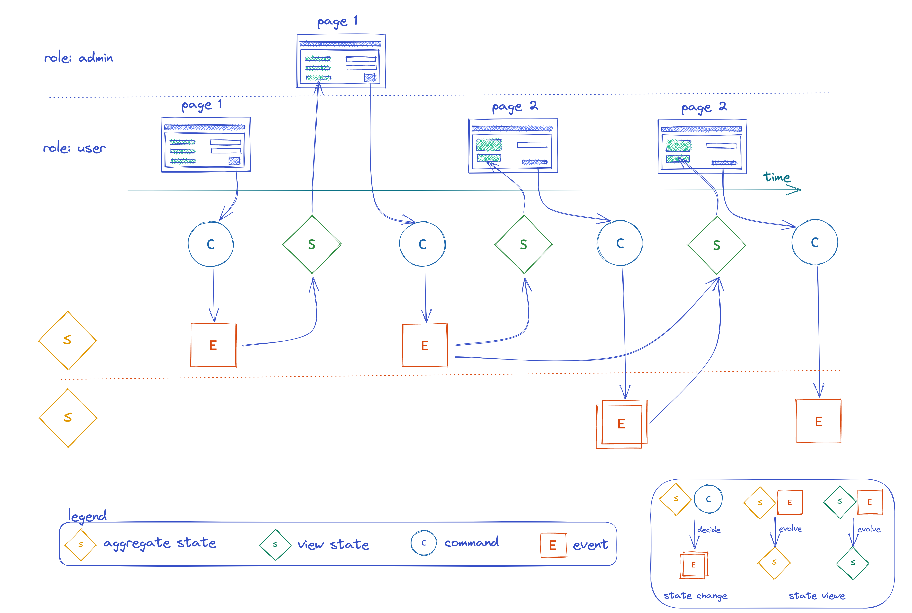

## Table of Contents

* [<strong>f(model)</strong> - Functional domain modeling](#fmodel---functional-domain-modeling)
    * [Multiplatform](#multiplatform)
    * [Abstraction and generalization](#abstraction-and-generalization)
    * [decide: (C, S) -&gt; Flow&lt;E&gt;](#decide-c-s---flowe)
    * [evolve: (S, E) -&gt; S](#evolve-s-e---s)
    * [Event-sourced or State-stored systems](#event-sourced-or-state-stored-systems)
    * [Decider](#decider)
        * [Decider extensions and functions](#decider-extensions-and-functions)
        * [Event-sourcing aggregate](#event-sourcing-aggregate)
        * [State-stored aggregate](#state-stored-aggregate)
    * [View](#view)
        * [View extensions and functions](#view-extensions-and-functions)
        * [Materialized View](#materialized-view)
    * [Saga](#saga)
        * [Saga extensions and functions](#saga-extensions-and-functions)
        * [Saga Manager](#saga-manager)
    * [Kotlin](#kotlin)
    * [Examples](#start-using-the-libraries)
    * [References and further reading](#references-and-further-reading)

## Multiplatform

Support for multiplatform programming is one of Kotlin’s key benefits. It reduces time spent writing and maintaining the
same code for different platforms while retaining the flexibility and benefits of native programming.

## Abstraction and generalization

Abstractions can hide irrelevant details and use names to reference objects. It emphasizes what an object is or does
rather than how it is represented or how it works.

Generalization reduces complexity by replacing multiple entities which perform similar functions with a single
construct.

Abstraction and generalization are often used together. Abstracts are generalized through parameterization to provide
more excellent utility.

## `decide: (C, S) -> Flow<E>`

On a higher level of abstraction, any information system is responsible for handling the intent (`Command`) and based on
the current `State`, produce new facts (`Events`):

- given the current `State/S` *on the input*,
- when `Command/C` is handled *on the input*,
- expect `flow` of new `Events/E` to be published/emitted *on the output*

## `evolve: (S, E) -> S`

The new state is always evolved out of the current state `S` and the current event `E`:

- given the current `State/S` *on the input*,
- when `Event/E` is handled *on the input*,
- expect new `State/S` to be published *on the output*

## Event-sourced or State-stored systems

- State-stored systems are traditional systems that are only storing the current State by overwriting the previous State
  in the storage.
- Event-sourced systems are storing the events in immutable storage by only appending.

### A statement:

Both types of systems can be designed by using only these two functions and three generic parameters:

- `decide: (C, S) -> Flow<E>`
- `evolve: (S, E) -> S`

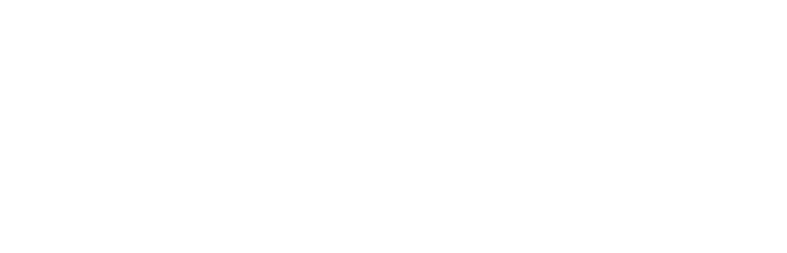

There is more to it! You can switch from one system type to another or have both flavors included within your systems
landscape.

<details>
  <summary>A proof</summary>

We can fold/recreate the new state out of the flow of events by using `evolve` function `(S, E) -> S` and providing the
initialState of type S as a starting point.

- `Flow<E>.fold(initialState: S, ((S, E) -> S)): S`

Essentially, this `fold` is a function that is mapping a flow of Events to the State:

- `(Flow<E>) -> S`

We can now use this function `(Flow<E>) -> S` to:

- contra-map our `decide` function (`(C, S) -> Flow<E>`) over `S` type to: `(C, Flow<E>) -> Flow<E>`  - **this is an
  event-sourced system**
- or to map our `decide` function (`(C, S) -> Flow<E>`) over `E` type to: `(C, S) -> S` - **this is a state-stored
  system**

</details>

Two functions are wrapped in a datatype class (algebraic data structure), which is generalized with three generic
parameters:

```kotlin
data class Decider<C, S, E>(
    val decide: (C, S) -> Flow<E>,
    val evolve: (S, E) -> S,
)
```

`Decider` is the most important datatype, but it is not the only one. There are others:

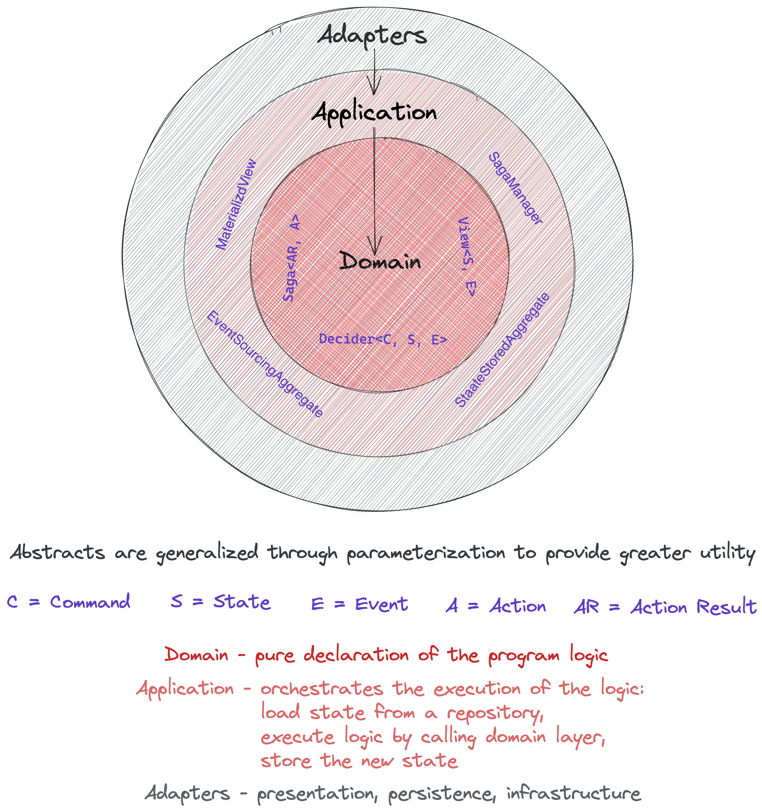

## Decider

`Decider` is a datatype that represents the main decision-making algorithm. It belongs to the Domain layer. It has three
generic parameters `C`, `S`, `E` , representing the type of the values that `Decider` may contain or use.
`Decider` can be specialized for any type `C` or `S` or `E` because these types do not affect its
behavior. `Decider` behaves the same for `C`=`Int` or `C`=`YourCustomType`, for example.

`Decider` is a pure domain component.

- `C` - Command
- `S` - State
- `E` - Event

```kotlin
data class Decider<in C, S, E>(
    override val decide: (C, S) -> Flow<E>,
    override val evolve: (S, E) -> S,
    override val initialState: S
) : IDecider<C, S, E> 
```

Additionally, `initialState` of the Decider is introduced to gain more control over the initial state of the Decider.
Notice that `Decider` implements an interface `IDecider` to communicate the contract.

<details>
  <summary>Example</summary>

```kotlin
fun restaurantOrderDecider() = Decider<RestaurantOrderCommand?, RestaurantOrder?, RestaurantOrderEvent?>(
    // Initial state of the Restaurant Order is `null`. It does not exist.
    initialState = null,
    // Exhaustive command handler(s): for each type of [RestaurantCommand] you are going to publish specific events/facts, as required by the current state/s of the [RestaurantOrder].
    decide = { c, s ->
        when (c) {
            is CreateRestaurantOrderCommand ->
                // ** positive flow **
                if (s == null) flowOf(RestaurantOrderCreatedEvent(c.identifier, c.lineItems, c.restaurantIdentifier))
                // ** negative flow **
                else flowOf(RestaurantOrderRejectedEvent(c.identifier, "Restaurant order already exists"))
            is MarkRestaurantOrderAsPreparedCommand ->
                // ** positive flow **
                if ((s != null && CREATED == s.status)) flowOf(RestaurantOrderPreparedEvent(c.identifier))
                // ** negative flow **
                else flowOf(
                    RestaurantOrderNotPreparedEvent(
                        c.identifier,
                        "Restaurant order does not exist or not in CREATED state"
                    )
                )
            null -> emptyFlow() // We ignore the `null` command by emitting the empty flow. Only the Decider that can handle `null` command can be combined (Monoid) with other Deciders.
        }
    },
    // Exhaustive event-sourcing handler(s): for each event of type [RestaurantEvent] you are going to evolve from the current state/s of the [RestaurantOrder] to a new state of the [RestaurantOrder]
    evolve = { s, e ->
        when (e) {
            is RestaurantOrderCreatedEvent -> RestaurantOrder(e.identifier, e.restaurantId, CREATED, e.lineItems)
            is RestaurantOrderPreparedEvent -> s?.copy(status = PREPARED)
            is RestaurantOrderErrorEvent -> s // Error events are not changing the state / We return current state instead.
            null -> s // Null events are not changing the state / We return current state instead. Only the Decider that can handle `null` event can be combined (Monoid) with other Deciders.
        }
    }
)
```

</details>

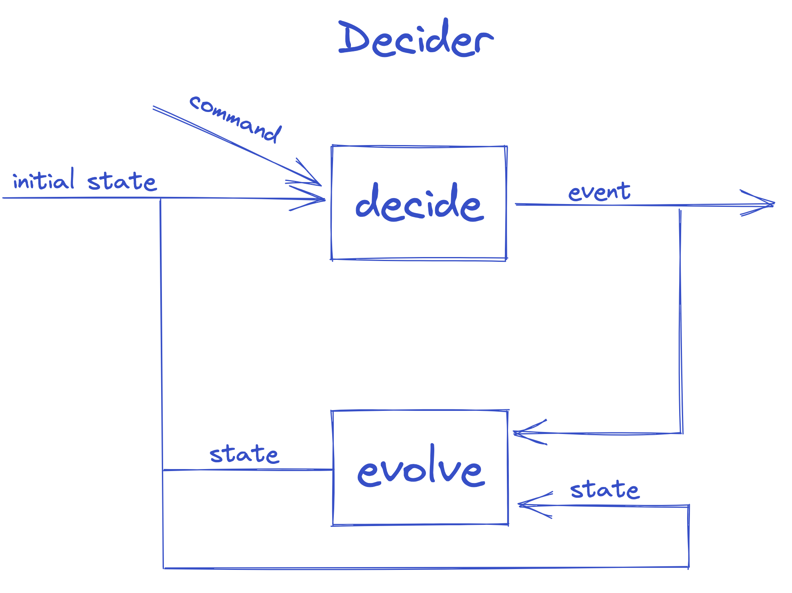

### Decider extensions and functions

#### Contravariant

- `Decider<C, S, E>.mapLeftOnCommand(f: (Cn) -> C): Decider<Cn, S, E>`

#### Profunctor (Contravariant and Covariant)

- `Decider<C, S, E>.dimapOnEvent(fl: (En) -> E, fr: (E) -> En): Decider<C, S, En>`
- `Decider<C, S, E>.dimapOnState(fl: (Sn) -> S, fr: (S) -> Sn): Decider<C, Sn, E>`

#### *Commutative* Monoid

- `<reified Cx : C_SUPER, Sx, reified Ex : E_SUPER, reified Cy : C_SUPER, Sy, reified Ey : E_SUPER, C_SUPER> Decider<Cx?, Sx, Ex?>.combine(
  y: Decider<Cy?, Sy, Ey?>
  ): Decider<C_SUPER, Pair<Sx, Sy>, E_SUPER>`

- with identity element `Decider<Nothing?, Unit, Nothing?>`

> A monoid is a type together with a binary operation (`combine`) over that type, satisfying associativity and having an
> identity/empty element.
> Associativity facilitates parallelization by giving us the freedom to break problems into chunks that can be computed
> in parallel.
>
> `combine` operation is also commutative. This means that the order in which deciders are combined does not affect the
> result.


We can now construct event-sourcing or/and state-storing aggregate by using the same `decider`.

### Event-sourcing aggregate

[Event sourcing aggregate](application/src/commonMain/kotlin/com/fraktalio/fmodel/application/EventSourcingAggregate.kt)
is using/delegating a `Decider` to handle commands and produce events. It belongs to the Application layer. In order to
handle the command, aggregate needs to fetch the current state (represented as a list of events)
via `EventRepository.fetchEvents` function, and then delegate the command to the decider which can produce new events as
a result. Produced events are then stored via `EventRepository.save` suspending function.

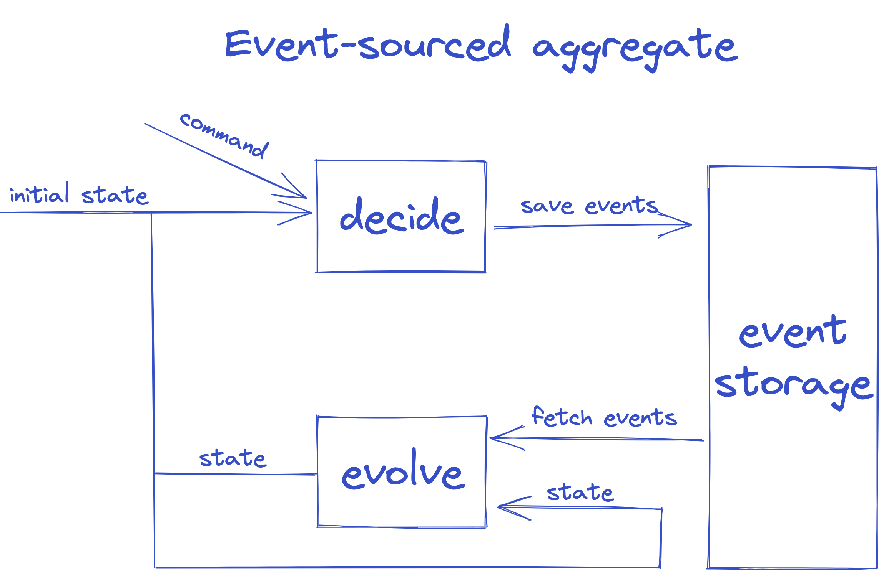

`EventSourcingAggregate` extends `IDecider` and `EventRepository` interfaces, clearly communicating that it is composed
out of these two behaviours.

The Delegation pattern has proven to be a good alternative to `implementation inheritance`, and Kotlin supports it
natively requiring zero boilerplate code.
`eventSourcingAggregate` function is a good example:

```kotlin
fun <C, S, E> eventSourcingAggregate(
    decider: IDecider<C, S, E>,
    eventRepository: EventRepository<C, E>
): EventSourcingAggregate<C, S, E> =
    object :
        EventSourcingAggregate<C, S, E>,
        EventRepository<C, E> by eventRepository,
        IDecider<C, S, E> by decider {}
```

<details>
  <summary>Example</summary>

```kotlin
typealias RestaurantOrderAggregate = EventSourcingAggregate<RestaurantOrderCommand?, RestaurantOrder?, RestaurantOrderEvent?>

fun restaurantOrderAggregate(
    restaurantOrderDecider: RestaurantOrderDecider,
    eventRepository: EventRepository<RestaurantOrderCommand?, RestaurantOrderEvent?>
): RestaurantOrderAggregate = eventSourcingAggregate(
    decider = restaurantOrderDecider,
    eventRepository = eventRepository,
)
```

</details>

### State-stored aggregate

[State stored aggregate](application/src/commonMain/kotlin/com/fraktalio/fmodel/application/StateStoredAggregate.kt) is
using/delegating a `Decider` to handle commands and produce new state. It belongs to the Application layer. In order to
handle the command, aggregate needs to fetch the current state via `StateRepository.fetchState` function first, and then
delegate the command to the decider which can produce new state as a result. New state is then stored
via `StateRepository.save` suspending function.

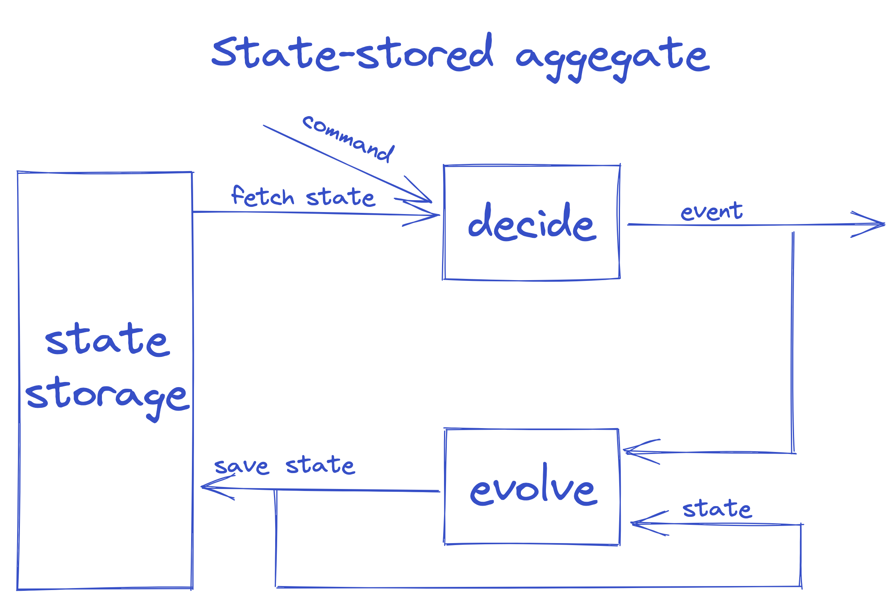

`StateStoredAggregate` extends `IDecider` and `StateRepository` interfaces, clearly communicating that it is composed
out of these two behaviours.

The Delegation pattern has proven to be a good alternative to `implementation inheritance`, and Kotlin supports it
natively requiring zero boilerplate code.
`stateStoredAggregate` function is a good example:

```kotlin
fun <C, S, E> stateStoredAggregate(
    decider: IDecider<C, S, E>,
    stateRepository: StateRepository<C, S>
): StateStoredAggregate<C, S, E> =
    object :
        StateStoredAggregate<C, S, E>,
        StateRepository<C, S> by stateRepository,
        IDecider<C, S, E> by decider {}
```

<details>
  <summary>Example</summary>

```kotlin
typealias RestaurantOrderAggregate = StateStoredAggregate<RestaurantOrderCommand?, RestaurantOrder?, RestaurantOrderEvent?>

fun restaurantOrderAggregate(
    restaurantOrderDecider: RestaurantOrderDecider,
    aggregateRepository: StateRepository<RestaurantOrderCommand?, RestaurantOrder?>
): RestaurantOrderAggregate = stateStoredAggregate(
    decider = restaurantOrderDecider,
    stateRepository = aggregateRepository
)
```

</details>

*The logic is orchestrated on the application layer. The components/functions are composed in different ways to support
variety of requirements.*

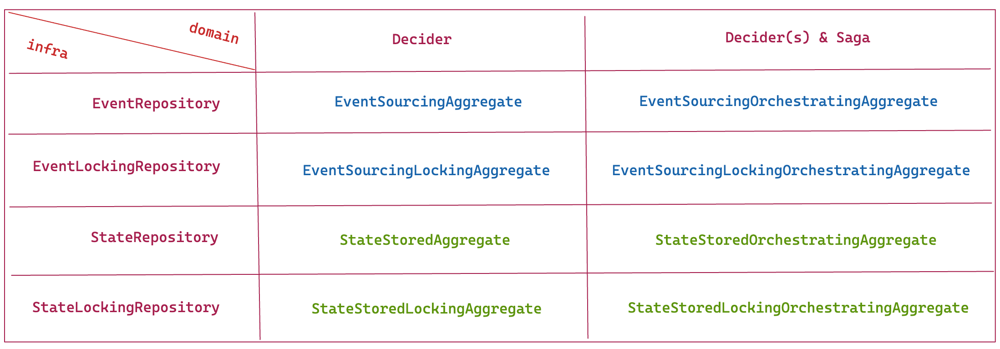

Check, [application-vanilla](application-vanilla) and [application-arrow](application-arrow) modules/libraries for
scenarios that are offered out of the box.

## View

`View`  is a datatype that represents the event handling algorithm, responsible for translating the events into
denormalized state, which is more adequate for querying. It belongs to the Domain layer. It is usually used to create
the view/query side of the CQRS pattern. Obviously, the command side of the CQRS is usually event-sourced aggregate.

It has two generic parameters `S`, `E`, representing the type of the values that `View` may contain or use.
`View` can be specialized for any type of `S`, `E` because these types do not affect its behavior.
`View` behaves the same for `E`=`Int` or `E`=`YourCustomType`, for example.

`View` is a pure domain component.

- `S` - State
- `E` - Event

```kotlin
data class View<S, in E>(
    override val evolve: (S, E) -> S,
    override val initialState: S
) : IView<S, E>
```

Notice that `View` implements an interface `IView` to communicate the contract.

<details>
  <summary>Example</summary>

```kotlin
fun restaurantOrderView() = View<RestaurantOrderViewState?, RestaurantOrderEvent?>(
    // Initial state of the [RestaurantOrderViewState] is `null`. It does not exist.
    initialState = null,
    // Exhaustive event-sourcing handling part: for each event of type [RestaurantOrderEvent] you are going to evolve from the current state/s of the [RestaurantOrderViewState] to a new state of the [RestaurantOrderViewState].
    evolve = { s, e ->
        when (e) {
            is RestaurantOrderCreatedEvent -> RestaurantOrderViewState(
                e.identifier,
                e.restaurantId,
                CREATED,
                e.lineItems
            )
            is RestaurantOrderPreparedEvent -> s?.copy(status = PREPARED)
            is RestaurantOrderErrorEvent -> s // We ignore the `error` event by returning current State/s.
            null -> s // We ignore the `null` event by returning current State/s. Only the View that can handle `null` event can be combined (Monoid) with other Views.

        }
    }
)
```

</details>

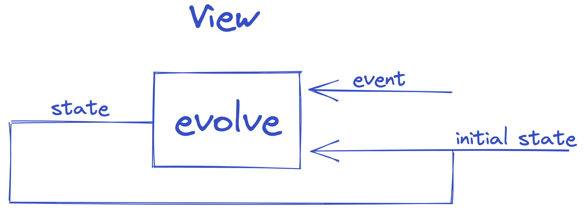

### View extensions and functions

#### Contravariant

- `View<S, E>.mapLeftOnEvent(f: (En) -> E): View<S, En>`

#### Profunctor (Contravariant and Covariant)

- `View<S, E>.dimapOnState(fl: (Sn) -> S, fr: (S) -> Sn): View<Sn, E>`

#### *Commutative* Monoid

- `<Sx, reified Ex : E_SUPER, Sy, reified Ey : E_SUPER, E_SUPER>  View<Sx, Ex?>.combine(y: View<Sy, Ey?>): View<Pair<Sx, Sy>, E_SUPER>`
- with identity element `View<Unit, Nothing?>`

> A monoid is a type together with a binary operation (combine) over that type, satisfying associativity and having an
> identity/empty element.
> Associativity facilitates parallelization by giving us the freedom to break problems into chunks that can be computed
> in parallel.
>
> `combine` operation is also commutative. This means that the order in which views are combined does not affect the
> result.


We can now construct `materialized` view by using this `view`.

### Materialized View

A [Materialized view](application/src/commonMain/kotlin/com/fraktalio/fmodel/application/MaterializedView.kt) is
using/delegating a `View` to handle events of type `E` and to maintain a state of denormalized projection(s) as a
result. Essentially, it represents the query/view side of the CQRS pattern. It belongs to the Application layer.

In order to handle the event, materialized view needs to fetch the current state via `ViewStateRepository.fetchState`
suspending function first, and then delegate the event to the view, which can produce new state as a result. New state
is then stored via `ViewStateRepository.save` suspending function.

`MaterializedView` extends `IView` and `ViewStateRepository` interfaces, clearly communicating that it is composed out
of these two behaviours.

The Delegation pattern has proven to be a good alternative to `implementation inheritance`, and Kotlin supports it
natively requiring zero boilerplate code.
`materializedView` function is a good example:

```kotlin
fun <S, E> materializedView(
    view: IView<S, E>,
    viewStateRepository: ViewStateRepository<E, S>,
): MaterializedView<S, E> =
    object : MaterializedView<S, E>, ViewStateRepository<E, S> by viewStateRepository, IView<S, E> by view {}
```

<details>
  <summary>Example</summary>

```kotlin
typealias RestaurantOrderMaterializedView = MaterializedView<RestaurantOrderViewState?, RestaurantOrderEvent?>

fun restaurantOrderMaterializedView(
    restaurantOrderView: RestaurantOrderView,
    viewStateRepository: ViewStateRepository<RestaurantOrderEvent?, RestaurantOrderViewState?>
): RestaurantOrderMaterializedView = materializedView(
    view = restaurantOrderView,
    viewStateRepository = viewStateRepository
)
```

</details>

*The logic is orchestrated on the application layer. The components/functions are composed in different ways to support
variety of requirements.*

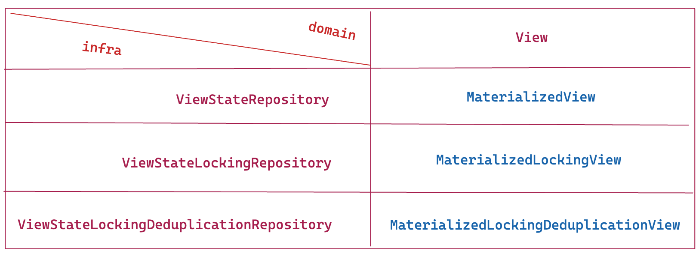

Check, [application-vanilla](application-vanilla) and [application-arrow](application-arrow) modules/libraries for
scenarios that are offered out of the box.

## Saga

`Saga` is a datatype that represents the central point of control, deciding what to execute next (`A`). It is
responsible for mapping different events from many aggregates into action results `AR` that the `Saga` then can use to
calculate the next actions `A` to be mapped to commands of other aggregates.

`Saga` is stateless, it does not maintain the state.

It has two generic parameters `AR`, `A`, representing the type of the values that `Saga` may contain or use.
`Saga` can be specialized for any type of `AR`, `A` because these types do not affect its behavior.
`Saga` behaves the same for `AR`=`Int` or `AR`=`YourCustomType`, for example.

`Saga` is a pure domain component.

- `AR` - Action Result
- `A`  - Action

```kotlin
data class Saga<AR, A>(
    val react: (AR) -> Flow<A>
) : I_Saga<AR, A>
```

Notice that `Saga` implements an interface `ISaga` to communicate the contract.

<details>
  <summary>Example</summary>

```kotlin

fun restaurantOrderSaga() = Saga<RestaurantEvent?, RestaurantOrderCommand>(
    react = { e ->
        when (e) {
            is RestaurantOrderPlacedAtRestaurantEvent -> flowOf(
                CreateRestaurantOrderCommand(
                    e.restaurantOrderId,
                    e.identifier,
                    e.lineItems
                )
            )
            is RestaurantCreatedEvent -> emptyFlow() // We choose to ignore this event, in our case.
            is RestaurantMenuActivatedEvent -> emptyFlow() // We choose to ignore this event, in our case.
            is RestaurantMenuChangedEvent -> emptyFlow() // We choose to ignore this event, in our case.
            is RestaurantMenuPassivatedEvent -> emptyFlow() // We choose to ignore this event, in our case.
            is RestaurantErrorEvent -> emptyFlow() // We choose to ignore this event, in our case.
            null -> emptyFlow() // We ignore the `null` event by returning the empty flow of commands. Only the Saga that can handle `null` event/action-result can be combined (Monoid) with other Sagas.
        }
    }
)

fun restaurantSaga() = Saga<RestaurantOrderEvent?, RestaurantCommand>(
    react = { e ->
        when (e) {
            //TODO evolve the example ;), it does not do much at the moment.
            is RestaurantOrderCreatedEvent -> emptyFlow()
            is RestaurantOrderPreparedEvent -> emptyFlow()
            is RestaurantOrderErrorEvent -> emptyFlow()
            null -> emptyFlow() // We ignore the `null` event by returning the empty flow of commands. Only the Saga that can handle `null` event/action-result can be combined (Monoid) with other Sagas.
        }
    }
)

 ```

</details>

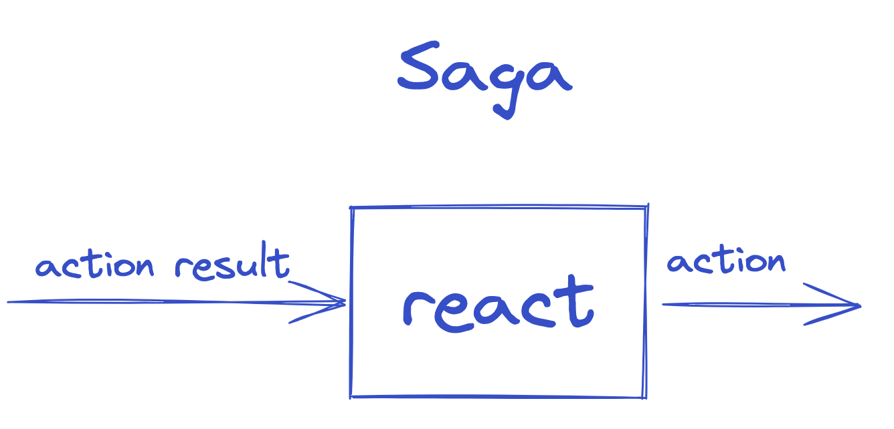

### Saga extensions and functions

#### Contravariant

- `Saga<AR, A>.mapLeftOnActionResult(f: (ARn) -> AR): Saga<ARn, A>`

#### Covariant

- `Saga<AR, A>.mapOnAction(f: (A) -> An): Saga<AR, An>`

#### Monoid

- `<reified ARx : AR_SUPER, Ax : A_SUPER, reified ARy : AR_SUPER, Ay : A_SUPER, AR_SUPER, A_SUPER> Saga<in ARx?, out Ax>.combine(y: Saga<in ARy?, out Ay>): Saga<AR_SUPER, A_SUPER>`
- with identity element `Saga<Nothing?, Nothing?>`

> A monoid is a type together with a binary operation (combine) over that type, satisfying associativity and having an
> identity/empty element.
> Associativity facilitates parallelization by giving us the freedom to break problems into chunks that can be computed
> in parallel.
>
> `combine` operation is also commutative. This means that the order in which sagas are combined does not affect the
> result.


We can now construct `Saga Manager` by using this `saga`.

### Saga Manager

[Saga manager](application/src/commonMain/kotlin/com/fraktalio/fmodel/application/SagaManager.kt) is a stateless process
orchestrator. It is reacting on Action Results of type `AR` and produces new actions `A` based on them.

Saga manager is using/delegating a `Saga` to react on Action Results of type `AR` and produce new actions `A` which are
going to be published via `ActionPublisher.publish` suspending function.

It belongs to the Application layer.

`SagaManager` extends `ISaga` and `ActionPublisher` interfaces, clearly communicating that it is composed out of these
two behaviours.

The Delegation pattern has proven to be a good alternative to `implementation inheritance`, and Kotlin supports it
natively requiring zero boilerplate code.
`sagaManager` function is a good example:

```kotlin
fun <AR, A> sagaManager(
    saga: ISaga<AR, A>,
    actionPublisher: ActionPublisher<A>
): SagaManager<AR, A> =
    object : SagaManager<AR, A>, ActionPublisher<A> by actionPublisher, ISaga<AR, A> by saga {}
```

<details>
  <summary>Example</summary>

```kotlin

typealias OrderRestaurantSagaManager = SagaManager<Event?, Command>

fun sagaManager(
    restaurantOrderSaga: RestaurantOrderSaga,
    restaurantSaga: RestaurantSaga,
    actionPublisher: ActionPublisher<Command>
): OrderRestaurantSagaManager = sagaManager(
    // Combining individual choreography Sagas into one orchestrating Saga.
    saga = restaurantOrderSaga.combine(restaurantSaga),
    // How and where do you want to publish new commands.
    actionPublisher = actionPublisher
)
```

</details>

### Experimental features

#### Actors (only on [JVM](https://github.com/fraktalio/fmodel/tree/main/application-vanilla/src/jvmMain/kotlin/com/fraktalio/fmodel/application))

Coroutines can be executed parallelly. It presents all the usual parallelism problems. The main problem being
synchronization of access to shared mutable
state. [Actors](https://kotlinlang.org/docs/shared-mutable-state-and-concurrency.html#actors) to the rescue!

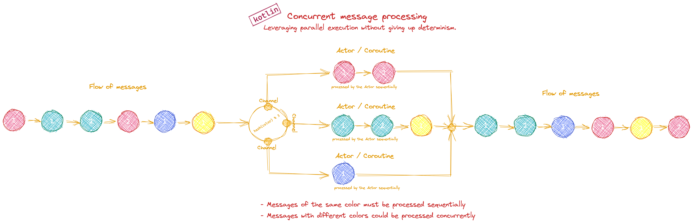

[Dive into the implementation ...](https://github.com/fraktalio/fmodel/tree/main/application-vanilla/src/jvmMain/kotlin/com/fraktalio/fmodel/application)

```kotlin
private fun <C, E> CoroutineScope.commandActor(
    fanInChannel: SendChannel<E>,
    capacity: Int = Channel.RENDEZVOUS,
    start: CoroutineStart = CoroutineStart.DEFAULT,
    context: CoroutineContext = EmptyCoroutineContext,
    handle: (C) -> Flow<E>
) = actor<C>(context, capacity, start) {
    for (msg in channel) {
        handle(msg).collect { fanInChannel.send(it) }
    }
}
```

> [Actors](https://kotlin.github.io/kotlinx.coroutines/kotlinx-coroutines-core/kotlinx.coroutines.channels/actor.html)
> are marked as @ObsoleteCoroutinesApi by Kotlin at the moment.

## Kotlin

*"Kotlin has both object-oriented and functional constructs. You can use it in both OO and FP styles, or mix elements of
the two. With first-class support for features such as higher-order functions, function types and lambdas, Kotlin is a
great choice if you’re doing or exploring functional programming."*

## Start using the libraries

All `fmodel` components/libraries are released to [Maven Central](https://repo1.maven.org/maven2/com/fraktalio/fmodel/)

### Maven coordinates

```
 <dependency>
    <groupId>com.fraktalio.fmodel</groupId>
    <artifactId>domain</artifactId>
    <version>3.5.0</version>
 </dependency>

 <dependency>
    <groupId>com.fraktalio.fmodel</groupId>
    <artifactId>application-vanilla</artifactId>
    <version>3.5.0</version>
 </dependency>
 
 <dependency>
    <groupId>com.fraktalio.fmodel</groupId>
    <artifactId>application-arrow</artifactId>
    <version>3.5.0</version>
 </dependency>
```

### Examples

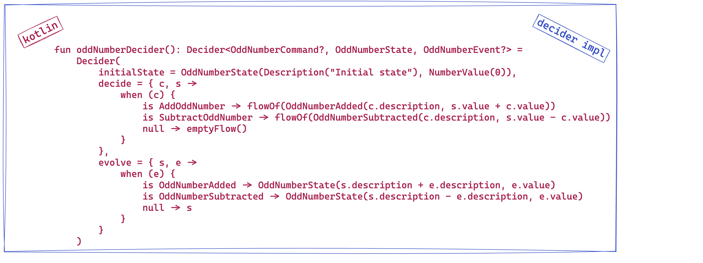

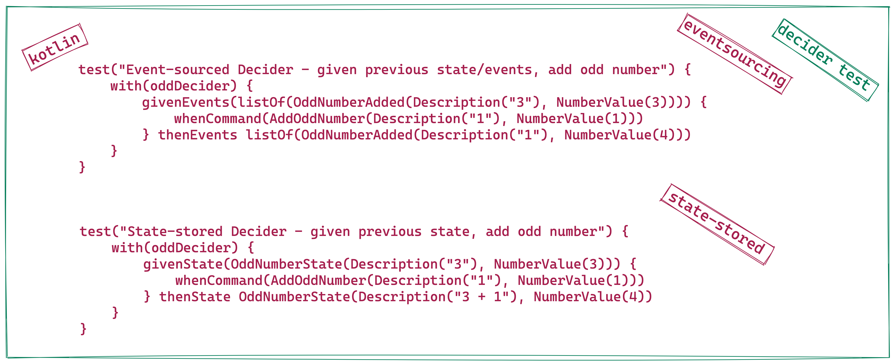

- Browse the [tests](domain/src/commonTest/kotlin/com/fraktalio/fmodel/domain/DeciderTest.kt)
- Learn by example on the [playground](https://fraktalio.com/blog/playground)
- Read the [blog](https://fraktalio.com/blog/)
- Check the demos
    - [Spring, R2DBC, Event Sourcing, CQRS, Postgres](https://github.com/fraktalio/fmodel-spring-demo)
    - [Spring, R2DBC, State-Stored, Postgres](https://github.com/fraktalio/fmodel-spring-state-stored-demo)
    - [Ktor, R2DBC, Event Sourcing, CQRS, Postgres](https://github.com/fraktalio/fmodel-ktor-demo)

### FModel in other languages

- [FModel in TypeScript](https://github.com/fraktalio/fmodel-ts)
- [FModel in Rust](https://github.com/fraktalio/fmodel-rust)

## References and further reading

- https://www.youtube.com/watch?v=kgYGMVDHQHs
- https://www.manning.com/books/functional-and-reactive-domain-modeling
- https://www.manning.com/books/functional-programming-in-kotlin
- https://www.47deg.com/blog/functional-domain-modeling/
- https://www.47deg.com/blog/functional-domain-modeling-part-2/
- https://www.youtube.com/watch?v=I8LbkfSSR58&list=PLbgaMIhjbmEnaH_LTkxLI7FMa2HsnawM_

## Credits

Special credits to `Jérémie Chassaing` for sharing his [research](https://www.youtube.com/watch?v=kgYGMVDHQHs)
and `Adam Dymitruk` for hosting the meetup.

---
Created with :heart: by [Fraktalio](https://fraktalio.com/)
