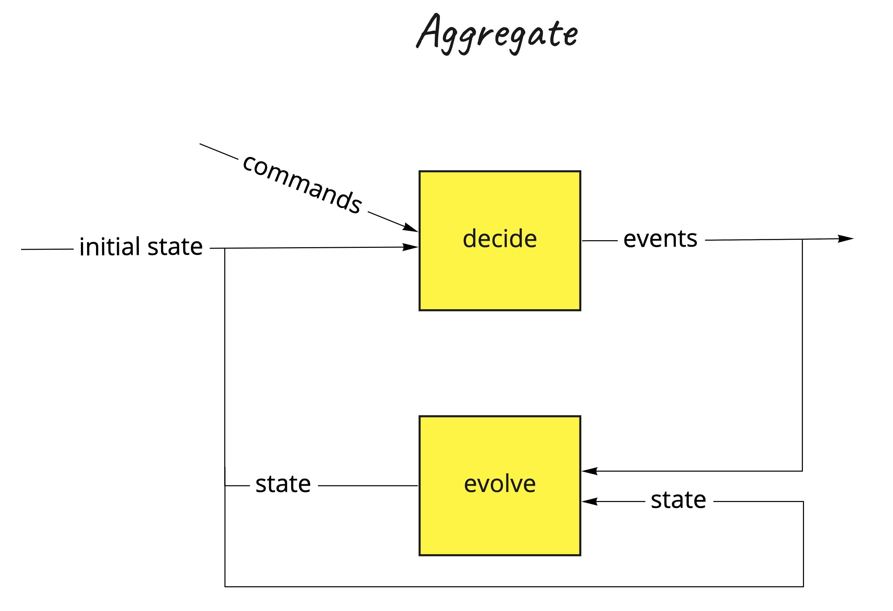

# Functional domain modeling - `f(model)`

The word `domain` here means the area of interest in the business.
When you’re developing an `information system` to automate activities of that business, you’re modeling the
business. The abstractions that you design, the behaviors that you implement, and the UI interactions that you build all reflect the business — *together they constitute the `model` of the domain*.

## `IOR<Library, Inspiration>`
This project can be used as a library, or as an inspiration, or both.

**Please note, that this project is in the experimental phase. The API will most probably change.**

## Table of Contents

   * Functional domain modeling
      * [decide: (C, S) -&gt; Iterable&lt;E&gt;](#decide-c-s---iterablee)
      * [evolve: (S, E) -&gt; S](#evolve-s-e---s)
      * [Event-sourced or State-stored systems](#event-sourced-or-state-stored-systems)
         * [A statement:](#a-statement)
         * [A proof:](#a-proof)
         * [Event-sourced system decide: (C, Iterable&lt;E&gt;) -&gt; Iterable&lt;E&gt;](#event-sourced-system-decide-c-iterablee---iterablee)
         * [State-stored system decide: (C, S) -&gt; S](#state-stored-system-decide-c-s---s)
      * [Decider](#decider)
         * [Event-sourcing aggregate](#event-sourcing-aggregate)
         * [State-stored aggregate](#state-stored-aggregate)
         * [Decider extensions](#decider-extensions)
            * [Contravariant](#contravariant)
            * [Profunctor (Contravariant and Covariant)](#profunctor-contravariant-and-covariant)
            * [Applicative](#applicative)
            * [Monoid](#monoid)
      * [View](#view)
         * [Materialized View](#materialized-view)
         * [View extensions](#view-extensions)
            * [Contravariant](#contravariant-1)
            * [Profunctor (Contravariant and Covariant)](#profunctor-contravariant-and-covariant-1)
            * [Applicative](#applicative-1)
            * [Monoid](#monoid-1)
      * [Process](#process)
         * [Process manager](#process-manager)
         * [Process manager extensions](#process-manager-extensions)
      * [Kotlin](#kotlin)
      * [References and further reading](#references-and-further-reading)


## `decide: (C, S) -> Iterable<E>` 
**On a higher level of abstraction**, any information system is responsible for handling the intent (`Command`) and based on the current `State` produce new facts (`Events`):

 - given the current `S`tate *on the input*, 
 - when `C`ommand is handled *on the input*, 
 - expect `list/iterable` of new `E`vents to be published *on the output*

## `evolve: (S, E) -> S`
The new state is always evolved out of the current state `S` and the current event `E`:

 - given the current `S`tate *on the input*, 
 - when `E`vent is handled *on the input*, 
 - expect new `S`tate to be published *on the output*

## Event-sourced or State-stored systems

- State-stored systems are traditional systems that are only storing the current state by overwriting the previous state in the storage.
- Event-sourced systems are storing the events in an immutable storage by only appending.

### A statement:
Both types of the systems can be designed by using only these two functions and three generic parameters

- `decide: (C, S) -> Iterable<E>` 
- `evolve: (S, E) -> S`

There is more to it! You can switch from one system type to another, or have both flavors included within your systems landscape. 

### A proof:
We can fold/recreate the new state out of the list of events by using `evolve` function `(S, E) -> S` and providing the initialState of type S as a starting point.

`Iterable<E>.fold(initialState: S, ((S, E) -> S)): S`

Essentially, this `fold` is a function that is mapping a list of Events to the State: `(Iterable<E>) -> S`

We can now use this function `(Iterable<E>) -> S` to:

 - **contra-map our `decide` function type (`(C, S) -> Iterable<E>`) over `S` type**: `(C, Iterable<E>) -> Iterable<E>`   - this is an event-sourced system
 - **or to map it over `E` type**: `(C, S) -> S`   - this is a state-stored system


### Event-sourced system `decide: (C, Iterable<E>) -> Iterable<E>`
- The `decide` function of the event-sourced system can be derived from the more general `decide` function that was mentioned before: `( (C, S) -> Iterable<E> ).contramapOverE((Iterable<E>) -> S):  (C, Iterable<E>) -> Iterable<E>`
- The `evolve` function is now internal to the `decide` function, and not part of the public API.

### State-stored system `decide: (C, S) -> S`
- The `decide` function of the state-stored system can be derived from the more general `decide` function that was mentioned before: `( (C, S) -> Iterable<E> ).mapOverS((Iterable<E>) -> S): (C, S) -> S`
- The `evolve` function is now internal to the `decide` function, and not part of the public API.


**We can verify that we are able to design any information system (event-sourced or/and state-stored) in this way**, by using these two functions wrapped in a data-type class (algebraic data structure) which is generalized with 3 generic parameters: 
```kotlin
@higherkind
data class Decider<C, S, E>(
    val decide: (C, S) -> Iterable<E>,
    val evolve: (S, E) -> S,
) : DeciderOf<C, S, E> {
    companion object
}
```

>A [data-type](https://arrow-kt.io/docs/datatypes/intro/) is an abstraction that encapsulates one reusable coding pattern. These solutions have a canonical implementation that is generalized for all possible uses.
>In Kotlin programming language, a datatype is implemented by a data class, or a sealed hierarchy of data classes and objects. These data-types are generalized by having one or several generic parameters, and, to become a [type constructor](https://arrow-kt.io/docs/patterns/glossary/#type-constructors), they implement the interface `Kind` for these generic parameters.

>A type constructor is any class or interface that has at least one generic parameter. For example, ListK<A> or Option<A>. They’re called constructors because they’re similar to a factory function where the parameter is A, except type constructors only work for types.

>Kotlin (with Arrow) is a good fit for functional domain modeling. It offers us data class, sealed class, enum class, and inline class. And we have Arrow, which offers us some interesting generic algebraic data-types such as Either, Validated, Ior, etc.


## Decider

 `_Decider` is a datatype that represents the main decision-making algorithm.
 It has five generic parameters `C`, `Si`, `So`, `Ei`, `Eo` , representing the type of the values that `_Decider` may contain or use.
 `_Decider` can be specialized for any type `C` or `Si` or `So` or `Ei` or `Eo` because these types does not affect its behavior. `_Decider` behaves the same for `C`=`Int` or `C`=`YourCustomType`, for example.
 To indicate that `_Decider` is a type constructor for all values of `C`, `Si`, `So`, `Ei`, `Eo`, it implements `_DeciderOf`<`C`, `Si`, `So`, `Ei`, `Eo`>, which is a typealias of `Kind5`<`For_Decider`, `C`, `Si`, `So`, `Ei`, `Eo`>
 
 `_Decider` is a pure domain component.

- `C` - Command 
- `Si` - input State 
- `So` - output State  
- `Ei` - input Event  
- `Eo` - output Event  

We make a difference between input and output types, and we are more general in this case.
We can always specialize down to the 3 generic parameters: `typealias Decider<C, S, E> = _Decider<C, S, S, E, E>`


```kotlin
@higherkind
data class _Decider<C, Si, So, Ei, Eo>(
    val decide: (C, Si) -> Iterable<Eo>,
    val evolve: (Si, Ei) -> So,
    val initialState: So,
    val isTerminal: (Si) -> Boolean
) : _DeciderOf<C, Si, So, Ei, Eo> {
    companion object
}

typealias Decider<C, S, E> = _Decider<C, S, S, E, E>
```

Additionally, `initialState` of the Decider and `isTerminal` function are introduced to gain more control over the initial and final state of the Decider.

We can now construct event-sourcing or/and state-storing aggregate by using the same `decider`.



### Event-sourcing aggregate

Event sourcing aggregate is using a `Decider` to handle commands and produce events.
In order to handle the command, aggregate needs to fetch the current state (represented as a list of events) via `fetchEvents` function, and then delegate the command to the decider which can produce event(s) as a result.
Produced events are then stored via `storeEvents` **suspending function**.
It is the responsibility of the user to implement these functions `fetchEvents` and `storeEvents` per need.
These two functions are producing side effects (infrastructure), and they are deliberately separated from the decider (pure domain logic).

>Flagging a computation as suspend enforces a calling context, meaning the compiler can ensure that we can’t call the effect from anywhere other than an environment prepared to run suspended effects. That will be another suspended function or a Coroutine.
>This effectively means we’re decoupling the pure declaration of our program logic (frequently called algebras in the functional world) from the runtime. And therefore, the runtime has the chance to see the big picture of our program and decide how to run and optimize it.

```kotlin
@higherkind
data class EventSourcingAggregate<C, S, E>(
    val decider: Decider<C, S, E>,
    val storeEvents: suspend (Iterable<E>) -> Either<Error.StoringEventsFailed<E>, Success.EventsStoredSuccessfully<E>>,
    val fetchEvents: suspend (C) -> Either<Error.FetchingEventsFailed, Iterable<E>>
) : EventSourcingAggregateOf<C, S, E> {

    suspend fun handle(command: C): Either<Error, Success> =
        // Arrow provides a Monad instance for Either. Except for the types signatures, our program remains unchanged when we compute over Either. All values on the left side assume to be Right biased and, whenever a Left value is found, the computation short-circuits, producing a result that is compatible with the function type signature.
        either {
            val events = fetchEvents(command).bind()
            val state: S = validate(events.fold(decider.initialState, decider.evolve)).bind()
            storeEvents(decider.decide(command, state)).bind()
        }

    private fun validate(state: S): Either<Error, S> {
        return if (decider.isTerminal(state)) Either.left(Error.AggregateIsInTerminalState(state))
        else Either.right(state)
    }

    companion object
}
```
### State-stored aggregate

State stored aggregate is using a `Decider` to handle commands and produce new state.
In order to handle the command, aggregate needs to fetch the current state via `fetchState` function first, and then delegate the command to the decider which can produce new state as a result.
New state is then stored via `storeState` **suspending function**.
It is the responsibility of the user to implement these functions `fetchState` and `storeState` per need.
These two functions are producing side effects (infrastructure), and they are deliberately separated from the decider (pure domain logic).

>Flagging a computation as suspend enforces a calling context, meaning the compiler can ensure that we can’t call the effect from anywhere other than an environment prepared to run suspended effects. That will be another suspended function or a Coroutine.
>This effectively means we’re decoupling the pure declaration of our program logic (frequently called algebras in the functional world) from the runtime. And therefore, the runtime has the chance to see the big picture of our program and decide how to run and optimize it.

```kotlin
data class StateStoredAggregate<C, S, E>(
    val decider: Decider<C, S, E>,
    val storeState: suspend (S) -> Either<Error.StoringStateFailed<S>, Success.StateStoredSuccessfully<S>>,
    val fetchState: suspend (C) -> Either<Error.FetchingStateFailed, S?>
) : StateStoredAggregateOf<C, S, E> {

    suspend fun handle(command: C): Either<Error, Success> =
        // Arrow provides a Monad instance for Either. Except for the types signatures, our program remains unchanged when we compute over Either. All values on the left side assume to be Right biased and, whenever a Left value is found, the computation short-circuits, producing a result that is compatible with the function type signature.
        either {
            val currentState = fetchState(command).bind()
            val state = validate(currentState ?: decider.initialState).bind()
            storeState(decider.decide(command, state).fold(state, decider.evolve)).bind()
        }

    private fun validate(state: S): Either<Error, S> {
        return if (decider.isTerminal(state)) Either.left(Error.AggregateIsInTerminalState(state))
        else Either.right(state)
    }

    companion object
}
````

### Decider extensions

`Decider` defines a `monoid` in respect to the composition operation: `(Decider<Cx,Sx,Ex>, Decider<Cy,Sy,Ey>) -> Decider<Either<Cx,Cy>, Tuple2(Sx,Sy), Either<Ex,Ey>>`, and this is an associative binary operation `a+(b+c)=(a+b)+c`, with identity element `Decider<Nothing, Unit, Nothing>`

> A monoid is a type together with a binary operation (combine) over that type, satisfying associativity and having an identity/empty element.
> Associativity facilitates parallelization by giving us the freedom to break problems into chunks that can be computed in parallel.


#### Contravariant
- `Decider<C, Si, So, Ei, Eo>.lmapOnC(f: (Cn) -> C): Decider<Cn, Si, So, Ei, Eo>`

#### Profunctor (Contravariant and Covariant)
- `Decider<C, Si, So, Ei, Eo>.dimapOnE(
           fl: (Ein) -> Ei,
           fr: (Eo) -> Eon
       ): Decider<C, Si, So, Ein, Eon>`
- `Decider<C, Si, So, Ei, Eo>.lmapOnE(f: (Ein) -> Ei): Decider<C, Si, So, Ein, Eo>`
- `Decider<C, Si, So, Ei, Eo>.rmapOnE(f: (Eo) -> Eon): Decider<C, Si, So, Ei, Eon>`
- `Decider<C, Si, So, Ei, Eo>.dimapOnS(
           fl: (Sin) -> Si,
           fr: (So) -> Son
       ): Decider<C, Sin, Son, Ei, Eo>`
- `Decider<C, Si, So, Ei, Eo>.lmapOnS(f: (Sin) -> Si): Decider<C, Sin, So, Ei, Eo>`
- `Decider<C, Si, So, Ei, Eo>.rmapOnS(f: (So) -> Son): Decider<C, Si, Son, Ei, Eo>`

#### Applicative
- `rjustOnS(so: So): Decider<C, Si, So, Ei, Eo>`
- `Decider<C, Si, So, Ei, Eo>.rapplyOnS(ff: Decider<C, Si, (So) -> Son, Ei, Eo>): Decider<C, Si, Son, Ei, Eo>`
- `Decider<C, Si, So, Ei, Eo>.rproductOnS(fb: Decider<C, Si, Son, Ei, Eo>): Decider<C, Si, Tuple2<So, Son>, Ei, Eo>`

#### Monoid
- `Decider<C1, Si1, So1, Ei1, Eo1>.combineDeciders(
           y: Decider<C2, Si2, So2, Ei2, Eo2>
       ): Decider<Either<C1, C2>, Tuple2<Si1, Si2>, Tuple2<So1, So2>, Either<Ei1, Ei2>, Either<Eo1, Eo2>>`
- with identity element `Decider<Nothing, Unit, Nothing>`

>Typeclasses are interfaces that define a set of extension functions associated to one type. You may see them referred to as “extension interfaces.”


## View
`_View`  is a datatype that represents the event handling algorithm, responsible for translating the events into denormalized state, which is more adequate for querying.
It is usually used to create the view/query side of the CQRS pattern. Obviously, the command side of the CQRS is usually event-sourced aggregate.

It has three generic parameters `Si`, `So`, `E`, representing the type of the values that `_View` may contain or use.
`_View` can be specialized for any type of `Si`, `So`, `E` because these types does not affect its behavior.
`_View` behaves the same for `E`=`Int` or `E`=`YourCustomType`, for example.

`_View` is a pure domain component.

- `Si` - input State 
- `So` - output State  
- `E`  - Event

We make a difference between input and output types, and we are more general in this case.
We can always specialize down to the 2 generic parameters: `typealias View<S, E> = _View<S, S, E>`


```kotlin
@higherkind
data class _View<Si, So, E>(
    val evolve: (Si, E) -> So,
    val initialState: So,
) : _ViewOf<Si, So, E> {
    companion object
}

typealias View<S, E> = _View<S, S, E>
```

We can now construct `materialized` view by using this `view`.


### Materialized View

Materialized view is using/delegating a `View` to handle events of type `E` and to maintain a state of denormalized projection(s) as a result.
Essentially, it represents the query/view side of the CQRS pattern.

In order to handle the event, materialized view needs to fetch the current state via `fetchState` suspending function first, and then delegate the event to the view which can produce new state as a result.
New state is then stored via `storeState` suspending function.
It is the responsibility of the user to implement these functions `fetchState` and `storeState` per need.
These two functions are producing side effects (infrastructure), and they are deliberately separated from the view (pure domain logic).

>Flagging a computation as suspend enforces a calling context, meaning the compiler can ensure that we can’t call the effect from anywhere other than an environment prepared to run suspended effects. That will be another suspended function or a Coroutine.
>This effectively means we’re decoupling the pure declaration of our program logic (frequently called algebras in the functional world) from the runtime. And therefore, the runtime has the chance to see the big picture of our program and decide how to run and optimize it.


```kotlin
@higherkind
data class MaterializedView<S, E>(
    val view: View<S, E>,
    val storeState: suspend (S) -> Either<Error.StoringStateFailed<S>, Success.StateStoredSuccessfully<S>>,
    val fetchState: suspend (E) -> Either<Error.FetchingStateFailed, S?>
) : MaterializedViewOf<S, E> {

    suspend fun handle(event: E): Either<Error, Success> =
        // Arrow provides a Monad instance for Either. Except for the types signatures, our program remains unchanged when we compute over Either. All values on the left side assume to be Right biased and, whenever a Left value is found, the computation short-circuits, producing a result that is compatible with the function type signature.
        either {
            val oldState = fetchState(event).bind() ?: view.initialState
            val newState = view.evolve(oldState, event)
            storeState(newState).bind()
        }
    companion object
}
```

### View extensions

`View` defines a `monoid` in respect to the composition operation: `(View<Sx,Ex>, View<Sy,Ey>) -> View<Tuple2(Sx,Sy), Either<Ex,Ey>>`, and this is an associative binary operation `a+(b+c)=(a+b)+c`, with identity element `View<Unit, Nothing>`

#### Contravariant
- `View<Si, So, E>.lmapOnE(f: (En) -> E): View<Si, So, En>`

#### Profunctor (Contravariant and Covariant)
- `View<Si, So, E>.dimapOnS(
          fl: (Sin) -> Si,
          fr: (So) -> Son
      ): View<Sin, Son, E>`
- `View<Si, So, E>.lmapOnS(f: (Sin) -> Si): View<Sin, So, E>`
- `View<Si, So, E>.rmapOnS(f: (So) -> Son): View<Si, Son, E>`

#### Applicative
- `View<Si, So, E>.rapplyOnS(ff: View<Si, (So) -> Son, E>): View<Si, Son, E>`
- `rjustOnS(so: So): View<Si, So, E>`

#### Monoid
- `View<Si1, So1, E1>.combineViews(y: View<Si2, So2, E2>): View<Tuple2<Si1, Si2>, Tuple2<So1, So2>, Either<E1, E2>>`
- with identity element `View<Unit, Nothing>`

## Process
`_Process` is a datatype that represents the central point of control deciding what to execute next.
It is responsible for mapping different events from aggregates into action results (`AR`) that the `_Process` then can use to calculate the next actions (`A`) to be mapped to commands of other aggregates.

It has six generic parameters `AR`, `Si`, `So`, `Ei`, `Eo`, `A`, representing the type of the values that `_Process` may contain or use.
`_Process` can be specialized for any type of `AR`, `Si`, `So`, `Ei`, `Eo`, `A` because these types does not affect its behavior.
`_Process` behaves the same for `AR`=`Int` or `AR`=`YourCustomType`, for example.

 - `AR` - Action Result 
 - `Si` - input State
 - `So` - output State
 - `Ei` - input Event
 - `Eo` - output Event
 - `A`  - Action

We make a difference between input and output types, and we are more general in this case.
We can always specialize down to the 4 generic parameters: `typealias Process<AR, S, E, A> = _Process<AR, S, S, E, E, A>`

```kotlin
@higherkind
data class _Process<AR, Si, So, Ei, Eo, A>(
    val ingest: (AR, Si) -> Iterable<Eo>,
    val evolve: (Si, Ei) -> So,
    val react: (Si, Ei) -> Iterable<A>,
    val pending: (Si) -> Iterable<A>,
    val initialState: So,
    val isTerminal: (Si) -> Boolean
) : _ProcessOf<AR, Si, So, Ei, Eo, A> {

    companion object
}

typealias Process<AR, S, E, A> = _Process<AR, S, S, E, E, A>
```
We can now construct `Process manager` by using this `Process`.

### Process manager
Process manager is using/delegating a `_Process` to handle action results of type `AR` and publish next actions(`A`) as a result.
Action result is created out of different events published by different aggregates.
Action is the next action that should be taking place. Usually, it is mapped to the command of some aggregate to handle it.
Process manager maintains its own state.

`publishActionsAndStoreState` is a suspending function that takes the newly produced state by `Process` and stores it, by additionally publishing actions that should be taken further.

`fetchState` is a suspending function that takes the action result of type `AR` and results with `either` error `Error.FetchingStateFailed` or success `S?`

>Flagging a computation as suspend enforces a calling context, meaning the compiler can ensure that we can’t call the effect from anywhere other than an environment prepared to run suspended effects. That will be another suspended function or a Coroutine.
>This effectively means we’re decoupling the pure declaration of our program logic (frequently called algebras in the functional world) from the runtime. And therefore, the runtime has the chance to see the big picture of our program and decide how to run and optimize it.

```kotlin
@higherkind
data class ProcessManager<AR, S, E, A>(
    val process: Process<AR, S, E, A>,
    val publishActionsAndStoreState: suspend (S, Iterable<A>) -> Either<Error.PublishingActionsFailed<S, A>, Success.ActionsPublishedSuccessfully<S, A>>,
    val fetchState: suspend (AR) -> Either<Error.FetchingStateFailed, S?>
) : ProcessManagerOf<AR, S, E, A> {

    suspend fun handle(actionResult: AR): Either<Error, Success.ActionsPublishedSuccessfully<S, A>> =
        // Arrow provides a Monad instance for Either. Except for the types signatures, our program remains unchanged when we compute over Either. All values on the left side assume to be Right biased and, whenever a Left value is found, the computation short-circuits, producing a result that is compatible with the function type signature.
        either {
            val state = validate(fetchState(actionResult).bind() ?: process.initialState).bind()
            val events = process.ingest(actionResult, state)
            publishActionsAndStoreState(
                events.fold(state, process.evolve),
                events.map { process.react(state, it) }.flatten()
            ).bind()
        }

    private fun validate(state: S): Either<Error, S> {
        return if (process.isTerminal(state)) Either.left(Error.ProcessManagerIsInTerminalState(state))
        else Either.right(state)
    }

    companion object
}
```
### Process manager extensions
TODO - not implemented yet


## Kotlin

*"Kotlin has both object-oriented and functional constructs.
You can use it in both OO and FP styles, or mix elements of the two.
With first-class support for features such as higher-order functions, function types and lambdas, Kotlin is a great choice if you’re doing or exploring functional programming."*

## References and further reading

This project is inspired by [Jérémie Chassaing](https://github.com/thinkbeforecoding)'s [research](https://www.youtube.com/watch?v=kgYGMVDHQHs) of the functional modeling and functional event sourcing. 

 - https://www.youtube.com/watch?v=kgYGMVDHQHs
 - https://www.manning.com/books/functional-and-reactive-domain-modeling
 - https://www.manning.com/books/functional-programming-in-kotlin
 - https://www.47deg.com/blog/functional-domain-modeling/
 - https://www.youtube.com/watch?v=I8LbkfSSR58&list=PLbgaMIhjbmEnaH_LTkxLI7FMa2HsnawM_
 - https://www.raywenderlich.com/9527-functional-programming-with-kotlin-and-arrow-getting-started


---
Created with :heart: by [Fraktalio](https://fraktalio.com/)
